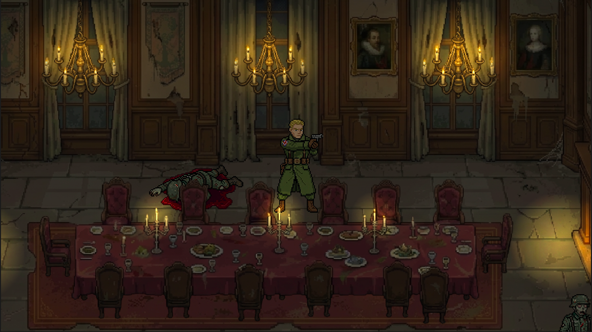

# Dread of the Dead

A survival horror pixel art game inspired by the classic *Resident Evil* series, set during the 1940s. Built from the ground up using **Godot 4.6**. 

This short demo serves to prototype the core game mechanics, including exploration, inventory management, and tense combat encounters.

### 🕹️ [Play the Web Demo on itch.io](https://tea-party-house-games.itch.io/dread-of-the-dead-demo?secret=jMgcMRjvFykIXHO8kfI37TQNN44)

## 📸 Gameplay

---

## 📖 Survival Manual: Field Controls

Welcome to the prototype for **Dread of the Dead**. Whether you prefer the precision of a keyboard or the classic feel of a controller, here is how you survive the night. The game fully supports simultaneous Keyboard + Mouse and Controller inputs.

### 🏃 Movement & Exploration

| Action | Keyboard & Mouse | Controller (PS / Xbox / Switch) |
| :--- | :--- | :--- |
| **Move / Aim Manually** | WASD / Arrow Keys | Left Analog / D-Pad |
| **Interact / Inspect** | **E** | Cross / A / B |
| **Run** | **Shift** | Circle / B / A |
| **Inventory / Pause** | **I** / **Tab** / **Esc** | Triangle / Y / X |

### 💥 Combat Engagement

| Action | Keyboard & Mouse | Controller (PS / Xbox / Switch) |
| :--- | :--- | :--- |
| **Ready Weapon (Aim)** | **RMB** / **CTRL** | L2 / LT / ZL |
| **Fire Weapon** | **LMB** / **Space** / **V** | R2 / RT / ZR |
| **Reload** | **R** | Square / X / Y |
| **Switch Aim Mode** | **Q** | Share / Back / Minus |
| **Cycle Target (Auto)** | **Z** | L1 / LB / L |

### 🎒 Inventory Management

| Action | Keyboard & Mouse | Controller (PS / Xbox / Switch) |
| :--- | :--- | :--- |
| **Navigate** | Mouse / WASD | D-Pad / Left Analog |
| **Select / Use Item** | **LMB** | Cross / A / B |

---

## 🛠️ Development & Building

This project was developed using Godot Engine v4.6. To run or modify the project:
1. Clone this repository.
2. Open Godot 4.6.
3. Import the `project.godot` file.
4. Press `F5` to run the main scene.